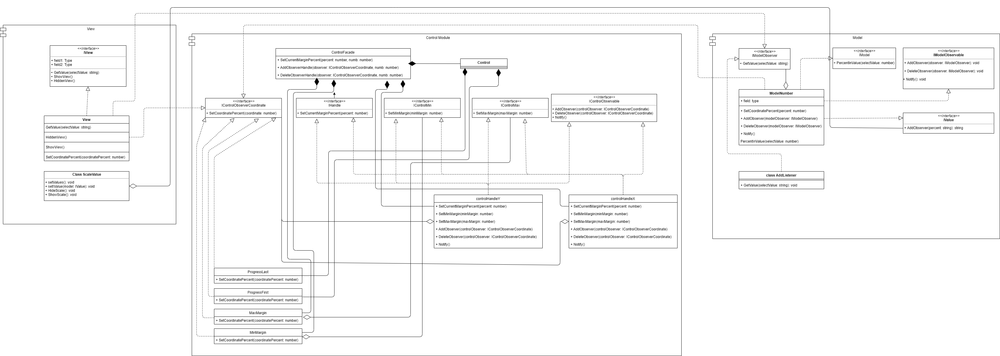

## **Слайдер**

[Демонстрация](https://dgrtf.github.io/FSDSlider/)

JQuery плагин слайдер.

### Содержание.
- [Использование](#использование)
- [API](#API)
- [UML диаграмма](#диаграмма)


### Использование.
Создаем слайдер:
```javascript
$('#slider').slider();
```
Инициализатор слайдера принимает объект со следующие параметрами:
- минимальное и максимальное значения
- размер шага
- одиночный или интервал
- горизонтальный или вертикальный вид

Здесь указаны значения по-умолчанию:

```javascript
const slider = $('#slider').slider({
    min: 0, // минимально возможное значение
    max: 100, // максимально возможное значение
    range: false, // диапазон
    orientation: false, // ориентация (true - горизонтальная)
});

```

### API.

#### События:
- изменение значения `'AddHandlerChangeValue'`

```javascript
slider.RangeSliderInit('AddHandlerChangeValue', (selectValue) => {
    console.log(selectValue);
}, item);
```
... ,где `selectValue` - текущее значение
`item` - номер элемента, значение которого вы хотите получить, отсчитываемый от нуля.
Для диапазона значений будет два ползунка.
Например для второго ползунка слева номер будет - 1, для первого - 0.
Строго говоря это не событие, а метод, ставящий очередного наблюдателя.


#### Методы:

Обратите внимание, что методы нельзя вызвать через точку, например метод `ShowValue` нельзя вызвать так:

```javascript
const slider = $('#slider').slider();

slider.ShowValue( 0 ); // Ошибка, такого метода не существует у объекта slider
```

Вместо такого обращения используйте:

```javascript
const slider = $('#slider').slider();

slider.RangeSliderInit("ShowValue" , 0); // Правильно, метод скрыл значение
```


- Задать текущее значение `'SetValue'`:

```javascript
slider.RangeSliderInit('SetValue', value, item);
```
... ,где `value` - желаемое значение, но значение меньше минимально возможного и минимального в выбранном диапазоне будут проигнорированы для ползунка, указывающего наибольшее значение в диапазоне.
Значения больше максимально возможного и максимального в выбранном диапазоне будут проигнорированы для ползунка, указывающего наименьшее значение в диапазоне.
`item` - номер значения, которое вы хотите задать, отсчитываемый от нуля.
Для диапазона значений будет два ползунка, каждый из которых можно задать независимо от другого.
Например для второго ползунка слева номер будет - 1, для первого - 0.


- Задать текущее значение в процентах `'SetValuePercent'`:

```javascript
slider.RangeSliderInit('SetValuePercent', value, item);
```
... ,где `value` - желаемое значение в процентах, но значение меньше минимально возможного и минимального в выбранном диапазоне будут проигнорированы для ползунка, указывающего наибольшее значение в диапазоне.
Значения больше максимально возможного и максимального в выбранном диапазоне будут проигнорированы для ползунка, указывающего наименьшее значение в диапазоне.
`item` - номер значения, которое вы хотите задать, отсчитываемый от нуля.
Для диапазона значений будет два ползунка, каждый из которых можно задать независимо от другого.
Например для второго ползунка слева номер будет - 1, для первого - 0.


- Максимально возможное значение `'SetMaxValue'`:

```javascript
slider.RangeSliderInit('SetMaxValue', maxValue);
```
... ,где `maxValue` - желаемое значение, но значение меньше минимально возможного будут проигнорированы.


- Минимально возможное значение `'SetMinValue'`:

```javascript
slider.RangeSliderInit('SetMinValue', minValue);
```
... ,где `minValue` - желаемое значение, но значение больше максимально возможного будут проигнорированы.


- Скрыть вид текущего значения `'HiddenValue'`:

```javascript
slider.RangeSliderInit('HiddenValue' , item);
```
... ,где `item` - номер значения, которое вы хотите скрыть, отсчитываемый от нуля.
Для диапазона значений будет два вида по умолчанию, каждый из которых можно скрыть независимо от другого.
Например для второго визуального отображения слева номер будет - 1, для первого - 0.


- Показать вид текущего значения `'ShowValue'`:

```javascript
slider.RangeSliderInit('ShowValue' , item);
```
... ,где `item` - номер значения, которое вы хотите показать, отсчитываемый от нуля.
Для диапазона значений будет два вида по умолчанию, каждый из которых можно скрыть независимо от другого.
Например для второго визуального отображения номер будет - 1, для первого - 0.


- Задать шаг `'SetStep'`:

```javascript
slider.RangeSliderInit('SetStep' , step);
```
... ,где `step` - желаемый шаг.


- Задать шаг `'GetSelectValue'`:

```javascript
slider.RangeSliderInit('GetSelectValue' , item);
```
... ,где `item` - номер ползунка, значение которого вы хотите получить, отсчитываемый от нуля.
Для диапазона значений будет два ползунка, значение каждого из которых можно получить независимо от другого.
Например для второго элемента номер будет - 1, для первого - 0.


### Диаграмма классов и архитектуры.

